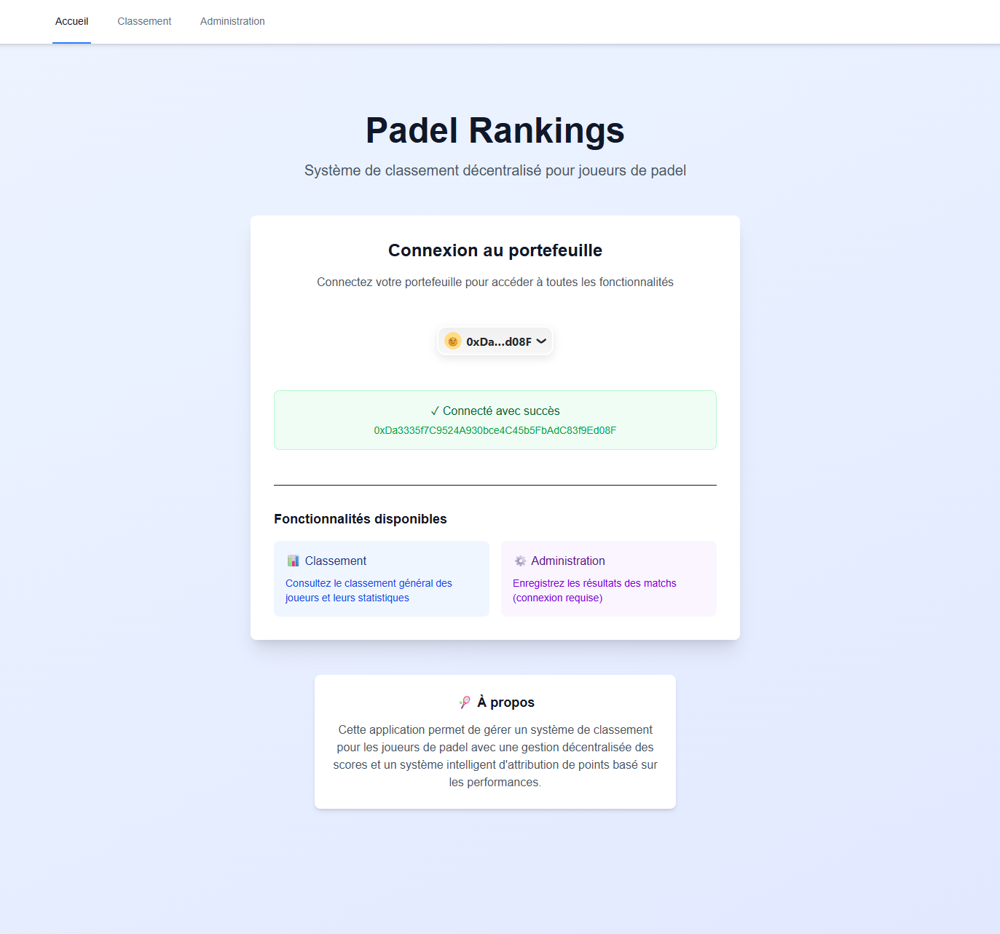
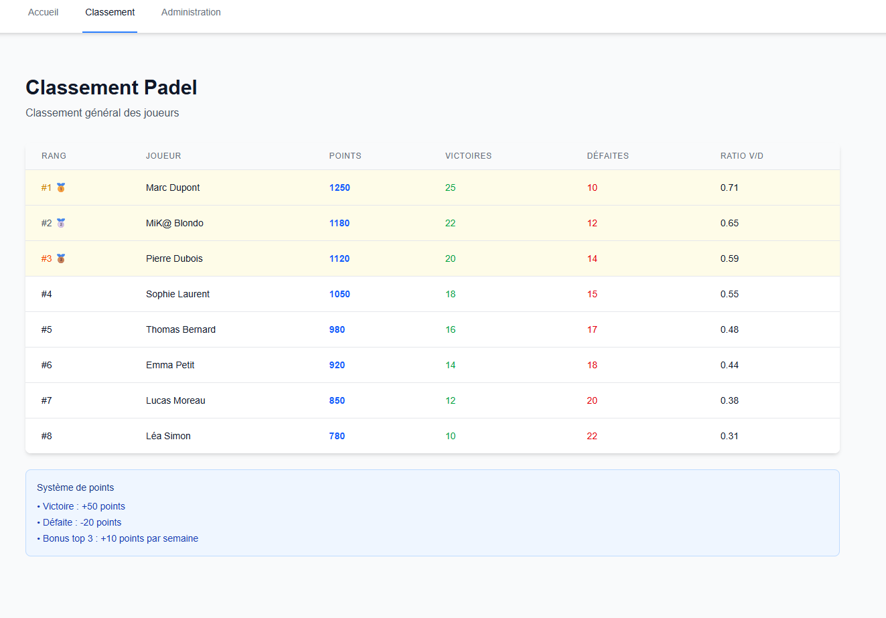
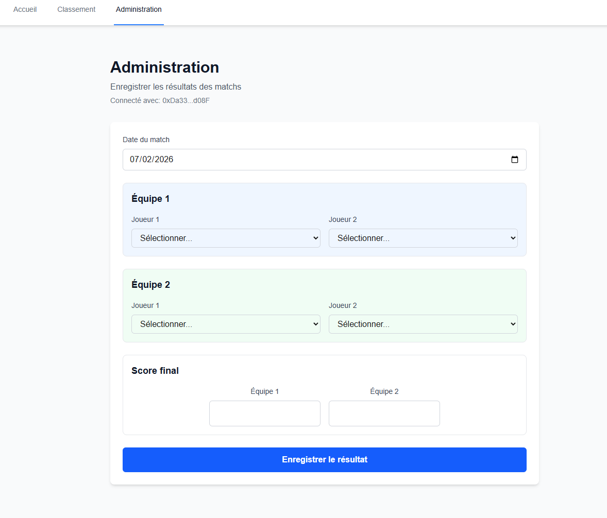

# PadelRank AI 🎾🤖

PadelRank AI est un projet Web3 qui explore
l’intégration du **Machine Learning** avec des **smart contracts Solidity**
pour gérer un **classement de joueurs de padel**.

L’objectif est simple :

> attribuer des points après chaque match de façon plus intelligente
> qu’avec des règles fixes.

---

## 🧠 Principe général

1. Des joueurs disputent un match de padel
2. Les informations du match sont envoyées à une IA (Machine Learning)
3. L’IA calcule combien de points bonus chaque joueur doit gagner (en plus des points fixes liés aux types de tournoi)
4. Ces points sont appliqués **on-chain** via un smart contract Solidity
5. Le classement est basé sur le total de points accumulés

---

## 🤖 Rôle de l’IA (Machine Learning)

L’IA ne prédit pas le vainqueur.
Elle sert à **évaluer la valeur d’un match**.

Elle prend en compte par exemple :

- le niveau des joueurs
- leur classement actuel
- l’écart de score
- le type de tournoi
- le tour du tournoi dans lequel le match s'est effectué (quart, demi, finale...)

Elle retourne un résultat simple : un entier représentant les points du vainqueur.

Ce nombre est ensuite appliqué par le smart contract.

L’IA est volontairement **simple et explicable**
(régression, pas de deep learning).

---

## 🔗 Rôle de la blockchain (Solidity)

Le smart contract :

- stocke les joueurs et leurs points
- applique les points calculés par l’IA
- empêche toute modification ou triche a posteriori

Il **ne fait aucun calcul IA**.
Il exécute des règles strictes et vérifiables.

---

## 🖥️ Rôle du frontend

Le frontend React :

- permet de saisir les résultats des matchs
- appelle l’API IA pour calculer les points
- envoie la transaction au smart contract
- affiche le classement des joueurs

Dans ce projet, le frontend joue aussi le rôle d’**oracle**.

---

## Stack technique

Les technologies principales choisies sont :  
– React pour l’IHM ([détails](#web3-frontend-stack)) ;  
– Solidity pour les smart contracts ([détails](#web3-backend-stack)) ;  
– Python pour le calcul des points via un modèle de machine learning ([détails](#ai-backend-stack)).

### 🗂️ Architecture du projet

Chaque partie a son répertoire.

```text
padelrank-ai/
│
├── ai/
│
├── blockchain/
│
├── frontend/
│
└── README.md (vous êtes ici :p)
```

### Web3 Frontend Stack

- **Next.js** – Framework React pour le frontend et le routing  
  🔗 [nextjs.org](https://nextjs.org)

- **viem** – Librairie bas niveau pour interagir avec Ethereum  
  🔗 [viem.sh](https://viem.sh)

- **wagmi** – Hooks React pour Web3 et gestion des wallets  
  🔗 [wagmi.sh](https://wagmi.sh)

- **RainbowKit** – UI pour la connexion aux wallets  
  🔗 [rainbowkit.com](https://www.rainbowkit.com)

### AI Backend Stack

- **FastAPI** – Framework pour créer des APIs en Python  
  🔗 [fastapi.tiangolo.com](https://fastapi.tiangolo.com)

- **scikit-learn** – Librairie pour le Machine Learning en Python  
  🔗 [scikit-learn.org](https://scikit-learn.org)

### Web3 Backend Stack

- **Hardhat v3** – Framework pour le développement de smart contracts Ethereum  
  🔗 [hardhat.org](https://hardhat.org)

## How to use

Merci de vous référer au README.md de chaque sous-partie :

- [Blockchain](./blockchain/README.md)
- [IA](./ai/README.md)
- [Frontend](./frontend/README.md)

## 🚧 Work in Progress
- formulaire sur l'ihm [#4](https://github.com/mickablondo/PadelRank_AI/issues/4);
- connexion ihm python [#4](https://github.com/mickablondo/PadelRank_AI/issues/4) ;
- connexion ihm blockchain [#4](https://github.com/mickablondo/PadelRank_AI/issues/4) ;
- smart contract... [#6](https://github.com/mickablondo/PadelRank_AI/issues/6) ;
- tableau ihm classement joueurs [#7](https://github.com/mickablondo/PadelRank_AI/issues/7) ;

### Ebauche de l'IHM

Page d'accueil :  
  

Page de classement :  
  

Page d'administration :  

